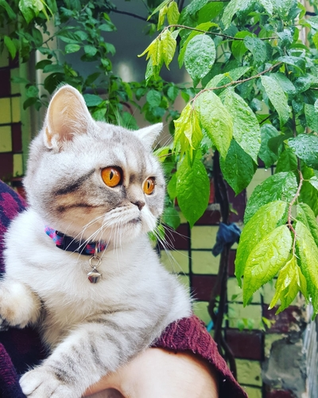

Meet Tesla.

Tesla is the friendliest, easiest-to-teach bot you've ever used.  He works on Slack, Hipchat, Rocket.chat, and more - so you can build your bot without platform lock-in.

He makes teaching your chat bot this simple:

```python
@respond_to("hi")
def say_hello(self, message):
    self.say("oh, hello!")
```


## DOCKER
```
docker-compose up -d
```

The base codes of Will was built by [Steven Skoczen] 
